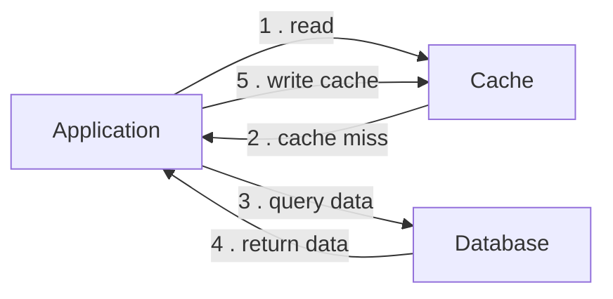

# Explain how cache aside work

## Diagrams

## Explanation

- Firstly, The Application read data from cache. If Cache has data, it will return data to application and end these
process.
- On other hand, if Cache hasn't data, it will return data null then application will directly query data from database.
- After returning data from database, the application might write these data to cache for next time accessing.

## Principles

- Lazy loading: Data is loaded into the cache only when it is requested by the application.

## Pros

- Easy to implement
- Suitable for read-heavy systems: reduce read latency and increase throughput for database.

## Cons
