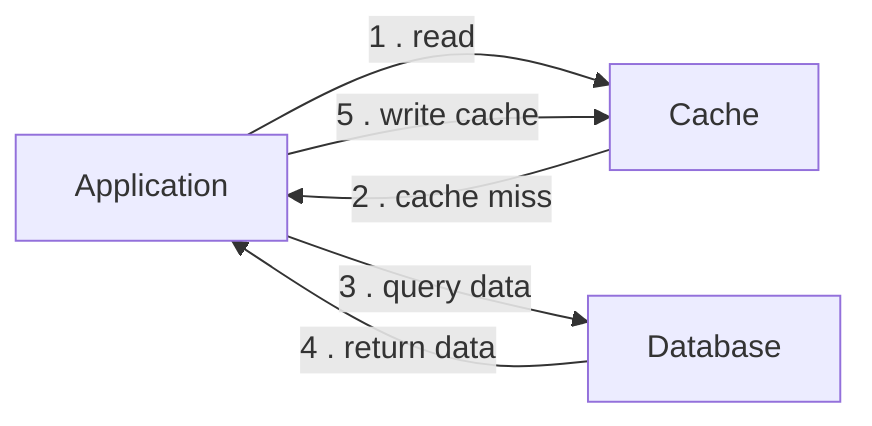
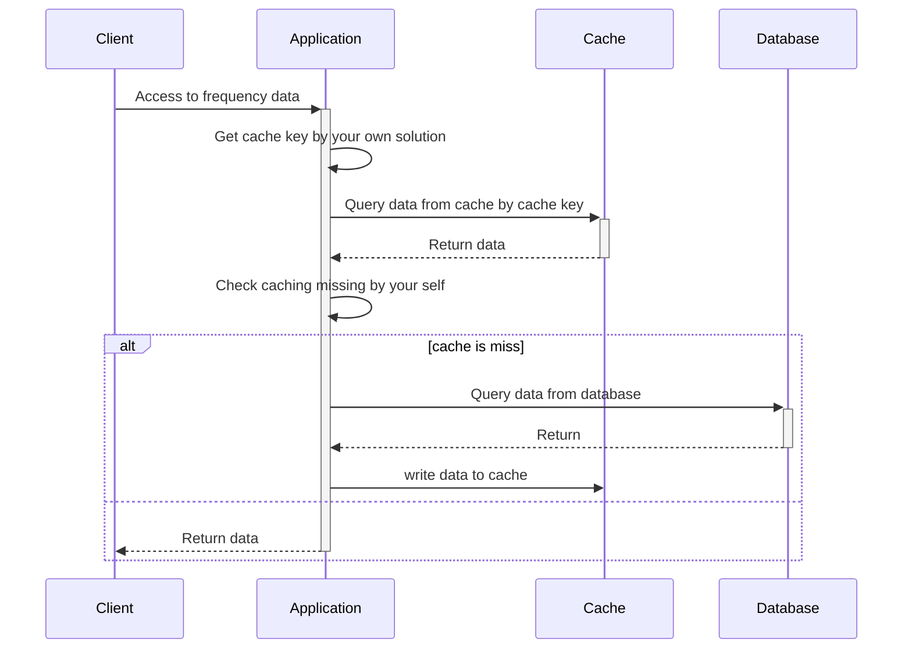

# Explain how cache aside work

## Diagrams

### Flows

### Sequence

## Explanation

- Firstly, The Application read data from cache. If Cache has data, it will return data to application and end these
  process.
- On other hand, if Cache hasn't data, it will return data null then application will directly query data from database.
- After returning data from database, the application might write these data to cache for next time accessing.

## Principles

- Lazy loading: Data is loaded into the cache only when it is requested by the application.

## Pros

- Easy to implement, flexible.
- Suitable for read-heavy systems: reduce read latency and increase throughput for database.

## Cons

- Depend on managing caching logic by your own solution. In other words, Cache-aside places caching logic within the
  application, thus you decide when to cache, when to invalidate caching data and how to handle cache misses.
- You might handle write caching by your own solution,
  therefore, if you don't do the right way and updates correctly this could lead your system has data inconsistencies.
